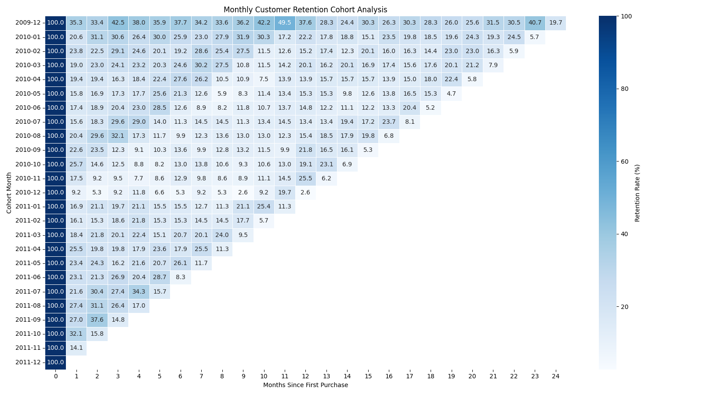
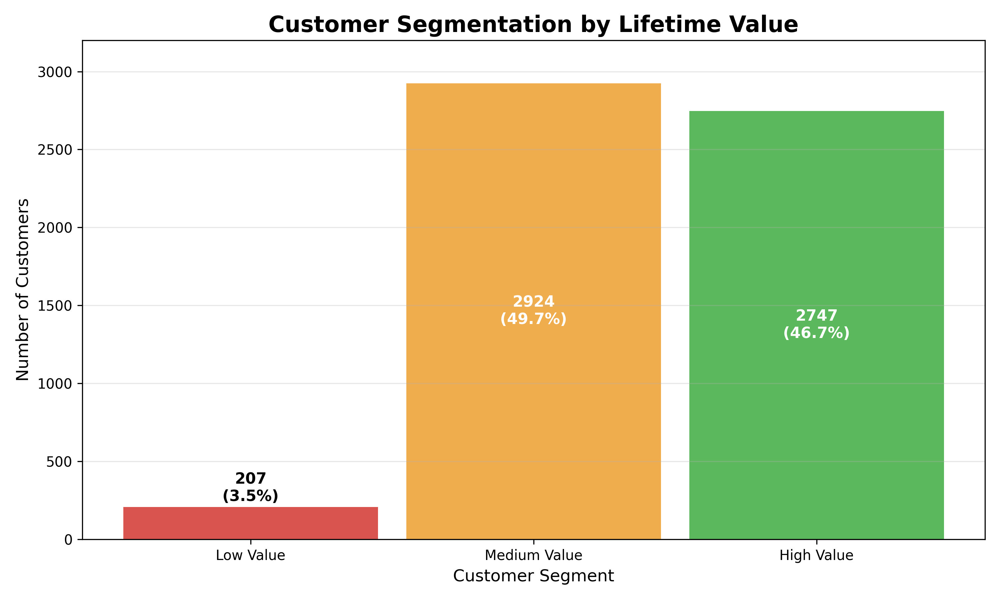
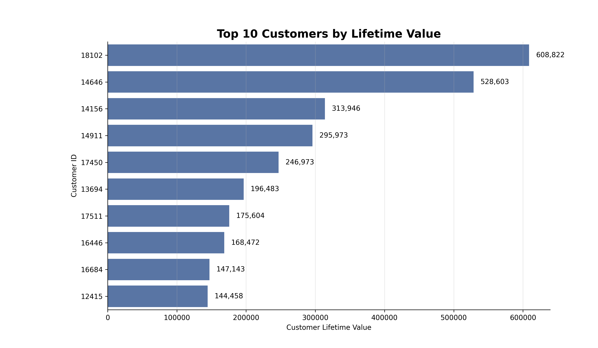
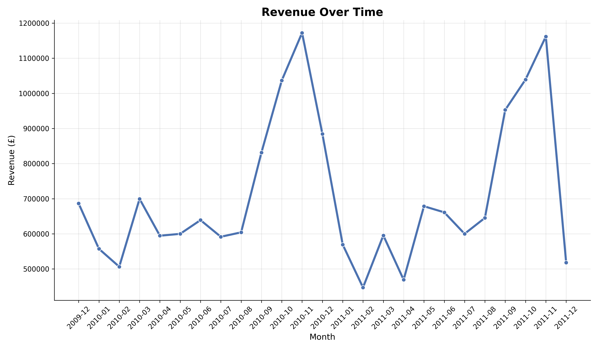

Customer Revenue & Retention Analysis

In this project I analyze customer behavior using translation data.

My goal is to understand:
- how customers return over time (retention)
- how much revenue they generate
- which cohorts perform better

Tools:
- SQL
- Python (pandas)
- Visualization (matplotlib/seaborn)

### DATA EXPLORATION ###

My goal is to understand dataset structure and check data quality.

What was done:
- Loaded dataset
- Checked shape and columns
- Checked missing values
- Found negative values and cancelled orders

Result:
Dataset contains missing CustomerID and invalid transactions (negative quantity, cancelled invoices)

*File:
`src/explore_data.py`

### DATA CLEANING ###

Clean dataset and remove invalid transaction.

What was done:
- Removed missing Customer_ID
- Filtered negative quantity
- Removed zero/negative prices
- Excluded cancelled invoices
- Converted date column 

*File:
`src/data_cleaning.py`

### LOAD TO SQL & REVENUE CALCULATION 

Load cleaned data into database and calculated revenue

What was done:
- Loaded data into SQLite
- Created `transactions` table
- Calculated revenue per order 
- Calculated revenue per customer

As a result , prepared revenue metrics for further analysis

*Files:
`src/load_to_sql.py`
`sql/revenue_analysis.sql`

### CUSTOMER ANALYSIS ###

Goal of this step, is to understand customer behavior

What was done:
- Calculated number of customers and orders 
- Measured average order value 
- Analyzed orders per customer
- calculated repeat customer rate 

Key Metrics:
- Total customers: 5,878
- Total orders: 36,969
- Average order value: ~480
- Average orders per customer: ~6.3
- Repeat customer rate: 72.39%

# Insights
The business shows strong customer engagement and retention.
On average, each customer makes more than 6 purchases, which indicates high loyalty.

A repeat customer rate above 70% suggests that most users return after their first purchase, highlighting a strong product-market fit and effective customer retention strategy.

### CUSTOMER LTV ###

My goal is to understand how much revenue each customer generates and identify high-value segments.

What was done:
- Calculated LTV per customer
- Measured average customer value 
- Segmented customers into Low, Medium and High value groups.

Key Metrics:
- Average LTV : ~3018

Customer distribution: 
- High Value: 2747 customers
- Medium Value: 2924 customers
- Low Value: 207 customers

# Insights

The business demonstrates strong customer value and retention.

The average customer generates over 3000 in revenue, indicating that users make multiply purchases over time.

A large proportion of customers fall into high-value segment, which suggests that revenue is not concentrated in a small group of users. Instead, many customers contribute significantly to overall revenue.

The relatively small number of low-value customers indicates a high-quality customer base with strong engagement and purchasing behavior.

### COHORT PREPARATION ###

In this step I was prepared cohort data for retention analysis.

What was done:
- Created `customer_cohort` table
- Identify each customers first purchase month (`cohort month`)
- Extracted purchase month for every transaction 
- Calculated months since first purchase 

Example:
Customer first purchase: 2009-12
Next purchase: 2010-03
Month since first purchase; 3

*Files:
`sql/cohort_preparation.sql`

### RETENTION ANALYSIS ###

Calculated customer retention metrics based on cohort behavior.

What was done:
- Creaded `retention_table` for cohort retention preparation 
- Created `retention_metrics` for final retention calculations
- Assigned customers to their first purchase cohort
- Calculated months since first purchase 
- Counted active customers by cohort and month
- Calculated total customers in each cohort
- Calculated retention rate (%)

Created database tables:
- `retention_table`
- `retention_metrics`

Key columns:
- `cohort_month` - customer´s first purchase month
- `months_since_first_purchase` - months after first purchase 
- `active_customers` - number of returning customers
- `total_customers` - total customers in the cohort 
- `retention_rate` - retention percentage

Files:
- `sql/retention_analysis.sql`
- `sql/retention_metrics.sql`

### DATA VISUALIZATION ###

This step includes several visualizations to support customer retention and revenue analysis.

# 1. RETENTION HEATMAP
A cohort retention heatmap showing customer retention rates over time. This visualization helps identify how customer engagement changes after the first purchase.

# 2. CUSTOMER LIFETIME VALUE DISTRIBUTION
Customer were segmented into Low Value, Medium Value and High Value groups based on their lifetime value. This chart provides insight into the distribution of customer profitability and overall customer value.

# 3. TOP 10 CUSTOMERS by LIFETIME VALUE 
A ranking of the ten most valuable customers based on total lifetime value. This visualization highlights the customers who contribute the most revenue to the business.

# 4. REVENUE OVER TIME
A time series visualization showing monthly revenue trends. This chart helps identify seasonality, growth patterns, and revenue fluctuations throughout the observed period.

### KEY FINDINGS ###

# Customer Retention
- Customer retention drops significantly after the first purchase month.
- Most cohorts retain approximately 25–40% of customers after one month.
- Several cohorts show temporary retention increases, suggesting seasonal purchasing behavior.

# Customer Lifetime Value
- The customer base is concentrated in the Medium and High Value segments.
- Only a small percentage of customers belong to the Low Value segment.
- High Value customers contribute a significant portion of total revenue.

# Top Customers
- A small group of customers generates exceptionally high lifetime value.
- The highest-value customer generated more than 600,000 in revenue.
- Revenue contribution is heavily concentrated among top customers.

# Revenue Trends
- Revenue demonstrates strong seasonal patterns.
- The highest revenue levels occur during the final months of the year.
- Revenue declines sharply after peak seasonal periods, indicating holiday-driven demand.

# Business Impact
- Retention improvement initiatives could significantly increase long-term customer value.
- High Value customers should be prioritized for loyalty and retention programs.
- Seasonal demand patterns should be considered when planning marketing campaigns and inventory management.